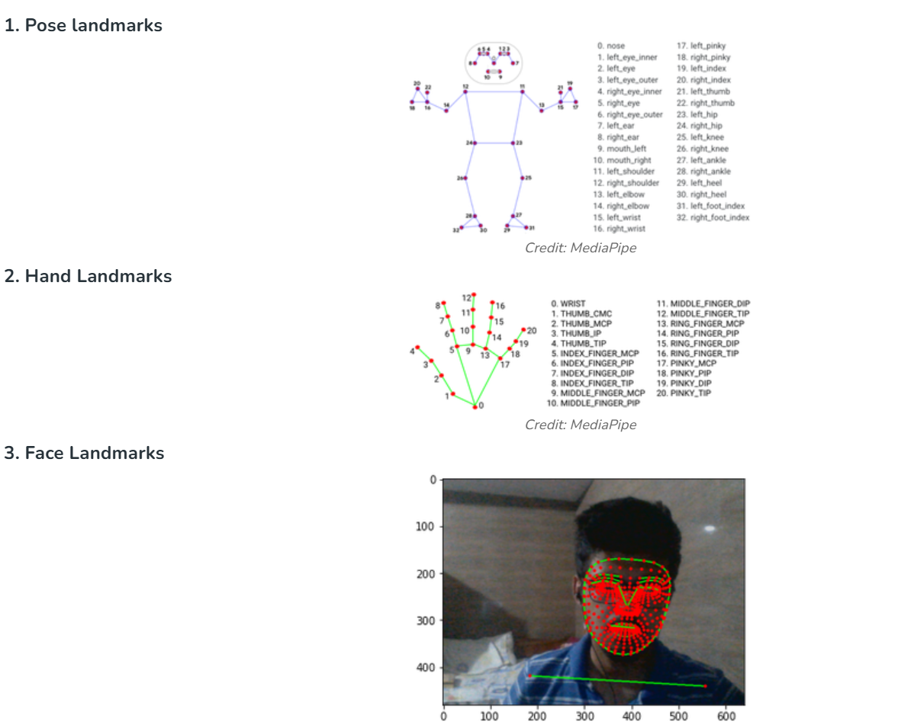
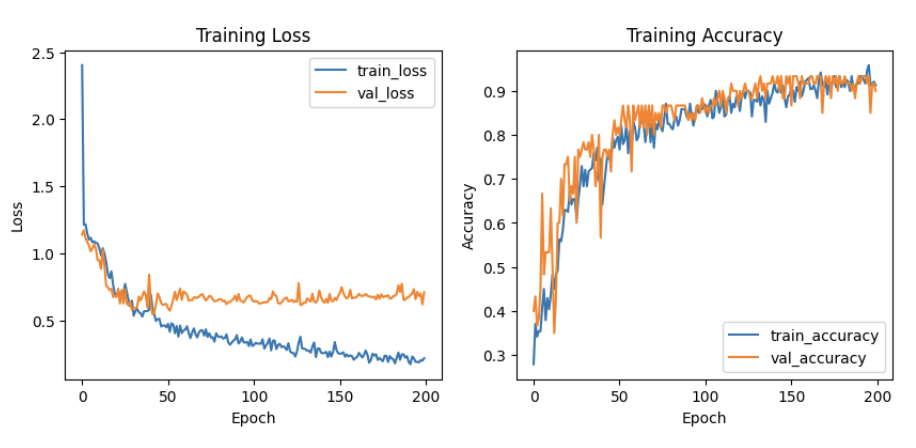
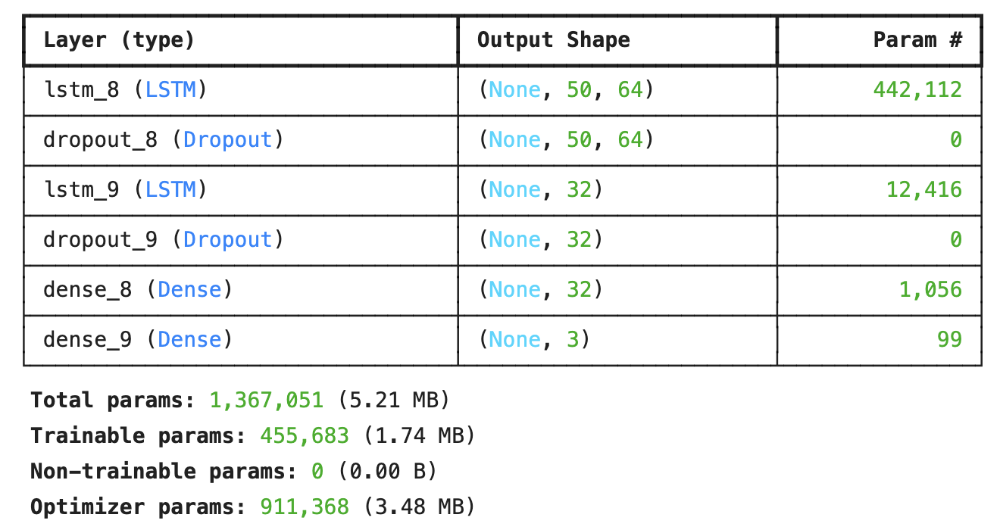

# Multimodal Sign Language & Emotion Recogntion

Student ID: 313540009

Name: Anna Kompan 安娜

### Introduction

A multimodal recognition system using MediaPipe Holistic (MP Holistic) for real-time tracking of body landmarks: face, left/right hands, body pose and recognizing sentence (sign language) and emotion of person showing sign, &&**combine prediction from two models and give one prediction on one frame.**

1. Sign Language Recognition

The system tracks arms, face, body movements

- 25 upper-body landmarks
- 468 face landmarks
- 21 per hand landmarks

Example of MP Holistic Landmarks

Source: GeekforGeeks

2. Emotion Recognition

**...processing**

### Contribution

The system main goal is:

- to be mediator, assistive tool (sign language to text)
- to improve human-computer interation (emotion-aware system)

### Install Dependencies

### Training and Validation Loss Curve

### Model

### Test in real time

