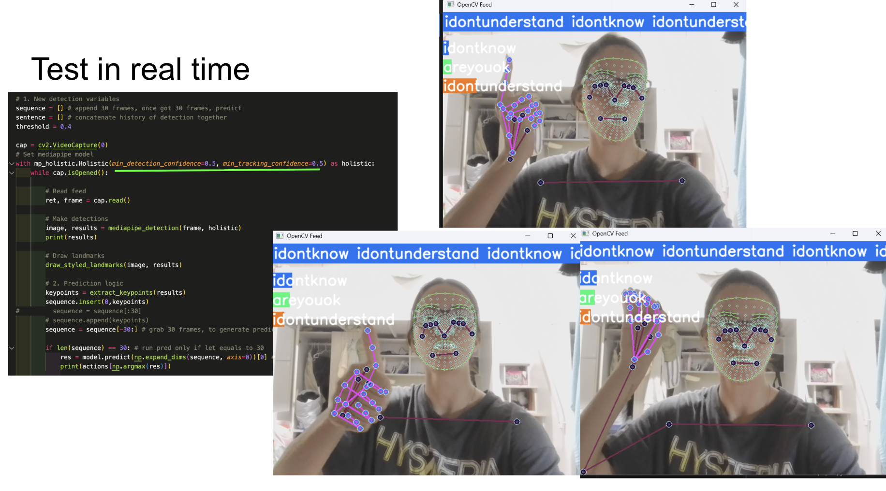

# Multimodal Sign Language & Emotion Recogntion

Student ID: 313540009 

Name: Anna Kompan (安娜)

Emotion Recognition

Facial landmarks and body pose information are extracted to capture subtle cues of human emotions.

These features are processed with deep learning models to classify emotional states.

Unlike conventional approaches relying solely on facial expressions, combining pose and gestures provides a more holistic understanding of emotions.

Sign Language Recognition

Hand landmarks (21 points per hand) along with pose estimation enable recognition of gestures used in sign language.

By incorporating both hand movements and body orientation, the system aims for higher accuracy than hand-only methods.

The focus is on building an efficient recognition pipeline that works in real-time, suitable for interactive applications.

Methodology

Feature Extraction: MediaPipe Holistic is used to extract structured landmark data (coordinates of hands, face mesh, and body).

Preprocessing: Normalization and sequence generation are applied to handle variations in position, scale, and motion.

Modeling: Deep learning methods such as LSTMs, CNNs, or hybrid models are explored to learn temporal and spatial patterns in landmark sequences.

Applications: The system is designed for assistive communication tools (e.g., sign language to text/speech) and human–computer interaction (emotion-aware systems).

Contribution

This research combines lightweight real-time landmark extraction (via MP Holistic) with sequence learning models to address two socially impactful problems:

Bridging the communication gap for sign language users.

Enhancing affective computing by recognizing emotions through multimodal cues.

Hand landmarks (21 points per hand) along with pose estimation enable recognition of gestures used in sign language.

By incorporating both hand movements and body orientation, the system aims for higher accuracy than hand-only methods.

The focus is on building an efficient recognition pipeline that works in real-time, suitable for interactive applications.
### Introduction
A multimodal recognition system using MediaPipe Holistic (MP Holistic) for real-time tracking of body landmarks: face, left/right hands, body pose and recognizing sentence (sign language) and emotion of person showing sign, &&**combine prediction from two models and give one prediction on one frame.**

1. Sign Language Recognition

The system tracks arms, face, body movements 

- 25 upper-body landmarks
- 468 face landmarks
- 21 per hand landmarks

Example of MP Holistic Landmarks
[!MP Holistic Example](./mp_holistic.png)
Source: GeekforGeeks

2. Emotion Recognition

### Install Dependencies
### Training and Validation Loss Curve
### Test in real time

